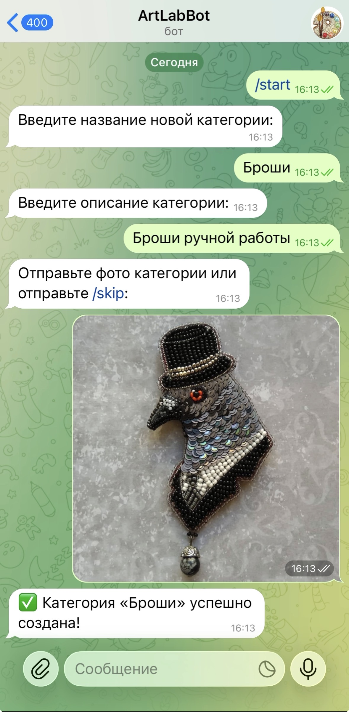

## Сервис по заказу изделий ручной работы
##### [telegram-bot-artlab]

Телегамм BOT для сервиса [art]Lab **ArtLabBot** написан на python с использованием библиотеки python-telegram-bot==20.6.

Backend API здесь: https://github.com/icez91/artlab-backend
<br/>Frontend здесь: https://github.com/icez91/artlab-frontend


Разворачивание проекта (через docker):

```chmod +x setup.sh && ./setup.sh```

---
### Доступный функционал:

CRUD для категорий и товаров для быстрой админки (с использованием api сервиса [art]Lab):
- действия могут совершать только пользователи с ролью админ или менеджер (вход через api backend)
- добавить категорию (фото + описание + выбор родительской категории или создание новой)
- обновить категорию (фото + описание + выбор родительской категории или сброс до новой)
- удалить категорию
- добавить товар (фото + описание + цена + выбор категории к товару)
- обновить товар (фото + описание + цена + выбор категории к товару)
- удалить товар

---
### Структура проекта

``` 
art-lab-telegram-bot/
├── bot/
│   ├── main.py                                 # точка входа
│   ├── handlers/
│   │   ├── start.py                            # команда /start
│   │   ├── categories.py                       # логика категорий
│   │   └── products.py                         # логика товаров
│   ├── core/
│   │   ├── api.py                              # обертка для запросов к backend API
│   │   └── logger.py                           # настройка логов
│   ├── utils/
│   │   ├── constants.py                        # константы
│   │   └── helpers.py                          # хелперы
├── .env.example                                # конфиг с токеном и API_URL (создайте локальный .env)
├── requirements.txt                            # список зависимостей
├── setup.sh                                    # установка и запуск
├── Dockerfile
└── docker-compose.yml
```

## DEMO
<a href="https://github.com/user-attachments/assets/81cce696-5bc8-4ade-9021-7828393f711e">
    
</a>
